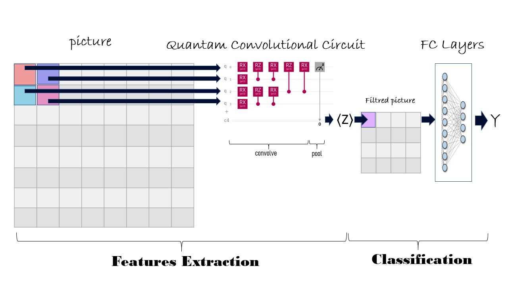

## 🤖 Intro

>> Our project is a work of three teammates, mentioned at the end of this document.
We've used a new method Called Hybrid Quantum-Classical Model which is a mixe between Quantum Circuits used as Neural Network and a Classical Neural Network,
Our Solution is about Brain Cancer Classification that means Classifying different Tumor types from MRI pictures so a Convolutional Neural Network is a normal method but here we did it with an Hybrid Quantum ConvNet as designed above:

## 👉 Process:
* Retrieve patient MRI image
* Process the image
* predict the result and display it
* Update the database 

## 👉 Installation
* Clone this repository
* Access deployment directory: `cd deployment`
* Run the command: `python manage.py runserver`
* Browse your MRI  and wait for the result

## 👉 Technologies
#### Modeling:
- Pennylane: Quantum Machine Learning Tool.
- Tensorflow: Classical Machine Learning Tool.
- OpenCv (cv2): Image Processing Tool.
- Pandas: Data Manipulation Tool.
- Numpy: Matrix Manipulation Tool
- Scikit-Learn (sklearn): Classical Machine Learning Tool.
- Matplotlib: Plotting Tool.

#### Web App
- Django: Python Web Framework.
